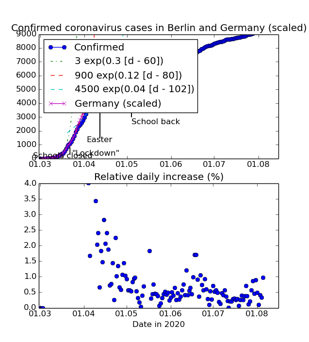

# corona-berlin-2020
Incidence of confirmed coronavirus cases in Berlin in 2020.

The data here is from the daily press releases shared by the Berlin
Senatsverwaltung für Gesundheit, Pflege und Gleichstellung
for confirmed Coronavirus cases.

Dates are the date of the *press release*, which is generally the
day after the time for which numbers were reported.

For the first few days, all cases were listed, then totals
broken out by Bezirk (district) and age.

See https://www.berlin.de/presse

## Data file
The main file is virus-berlin-2020.dat

There is one row for each day. Columns are separated by white space.
Columns are:

- Date, as YYYY-MM-DD
- Total number of cases in Berlin
- Delta, increase from yesterday's total
- One column for each [_Bezirk_](http://en.wikipedia.org/wiki/Boroughs%20and%20neighborhoods%20of%20Berlin),
  in alphabetical order
- The source of the statistics for this day

See [figure_1.png](figure_1.png)

